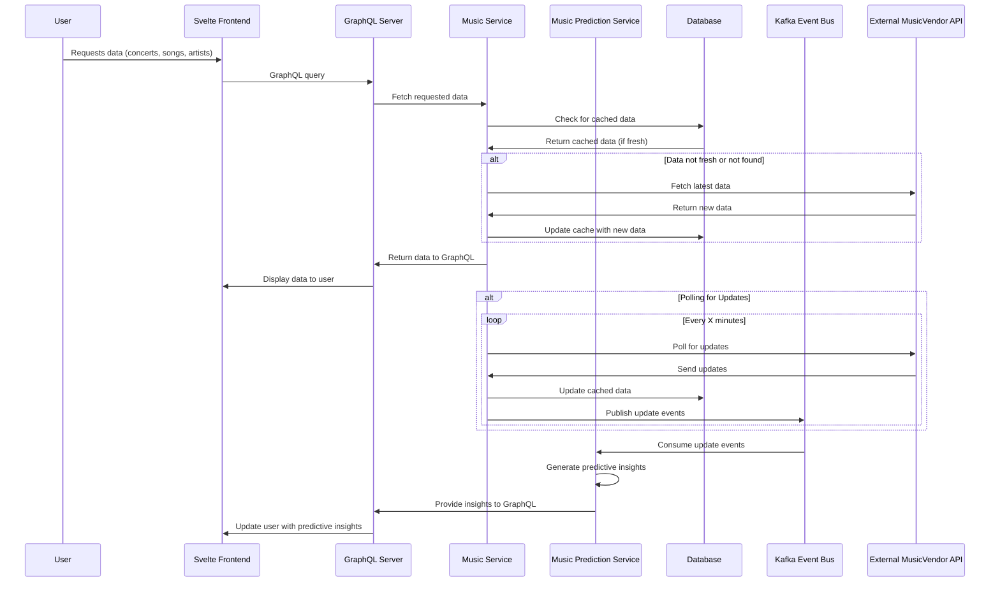

# Music Frontend

This repository contains the frontend code for a Music Frontend project, a web application that allows users to explore Music concerts, setlists, and song performances. The project is built using Svelte and integrates with backend services to fetch and display concert and song data.

## Service Interaction Diagram

Below is a sequence diagram showing how the frontend interacts with the [Concert](https://github.com/zjromani/concertservice) and [Song](https://github.com/zjromani/songservice) services, as well as external APIs to retrieve data:

## Learning Goals

This project and related backend services aim to provide hands on learning with:

- Svelte for Dynamic UIs
- gRPC & Kotlin
- Micronaut
- GraphQL Integration
- Event-Driven Architecture with Kafka
- Domain-Driven Design (DDD)
- API Design
- GitOps for Continuous Deployment
  - Terraform
  - Docker & Kubernetes

